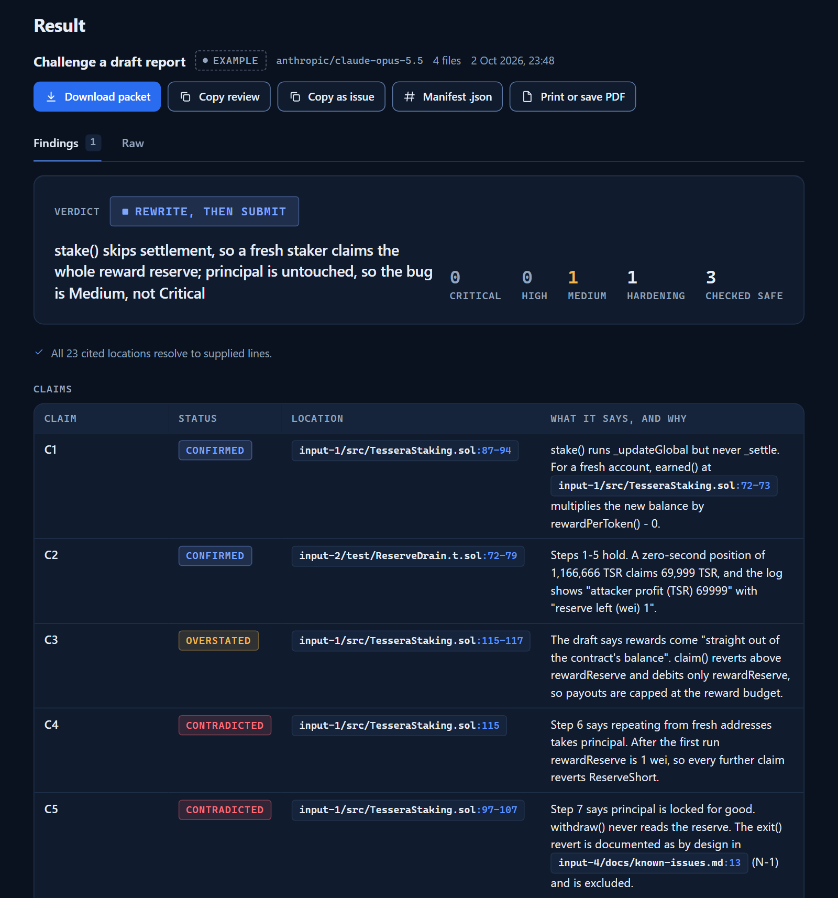
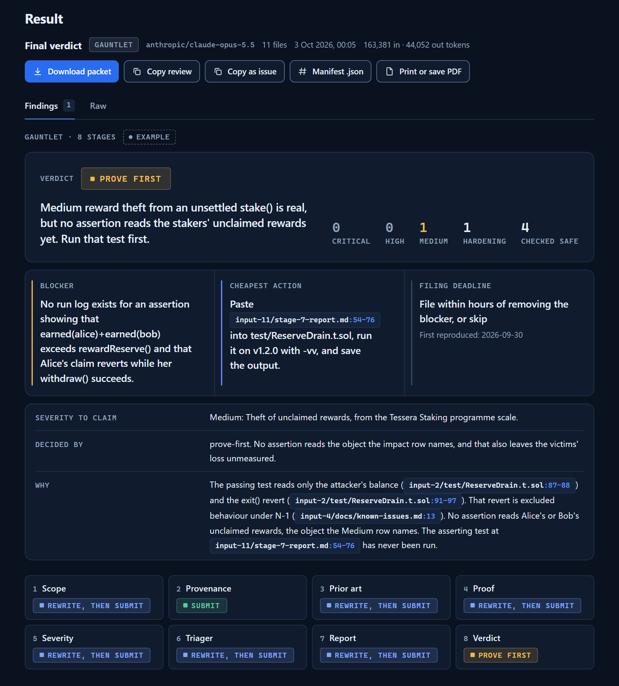

<div align="center">

# Bounty Operator

**Find the hole in your report before the triager does.**

Bounty Operator is the pre-submission adversary for bug bounty hunters and
smart-contract auditors. Give it the code and your draft finding. It argues
against the finding the way a triager will, ties every claim to a file and line,
and returns a verdict: `submit`, `rewrite-then-submit`, `prove-first`,
`hold-duplicate` or `drop`. It runs on your own model in the browser, inside
your AI client over MCP, or from the command line.

### [Open the workbench → bountyoperator.com](https://bountyoperator.com/)

[](https://github.com/bountyoperator/bounty-operator/releases)
[](LICENSE)


<a href="https://bountyoperator.com/"></a>

</div>

- **Every claim tied to file and line.** Findings cite `input-1/src/Vault.sol:142-158`.
  A reference to a file or line you did not supply is flagged. Each review
  downloads as a packet with a SHA-256 manifest of exactly what was reviewed.
- **The triager's objection first.** Each finding carries its strongest
  counterargument, whether the source resolves it, and the one missing artifact
  that would settle it.
- **Your model, your key, nothing stored.** OpenRouter, Anthropic, OpenAI,
  Gemini, xAI, DeepSeek, Mistral or Groq with your own key. A hosted review
  passes your files and your key through bountyoperator.com to that provider.
  Source files, keys and review text are never stored.

## Quick start

### Browser

Open [bountyoperator.com](https://bountyoperator.com/) and run the built-in
example. No account, no API key.

### MCP

Run reviews from Claude Code, Codex, Cursor or any MCP client. The remote
endpoint needs nothing installed.

Claude Code:

```bash
claude mcp add --transport http bounty-operator https://bountyoperator.com/api/mcp
```

Codex:

```bash
codex mcp add bounty-operator --url https://bountyoperator.com/api/mcp
```

Cursor, in `~/.cursor/mcp.json`:

```json
{ "mcpServers": { "bounty-operator": { "url": "https://bountyoperator.com/api/mcp" } } }
```

The local server reads files by path and keeps review preparation on your
machine. It needs Node 22 or later:

```bash
npx -y https://bountyoperator.com/dl/bounty-operator-mcp.tgz
```

```bash
claude mcp add --transport stdio bounty-operator -- npx -y https://bountyoperator.com/dl/bounty-operator-mcp.tgz
codex mcp add bounty-operator -- npx -y https://bountyoperator.com/dl/bounty-operator-mcp.tgz
```

The package is coming to npm as `bounty-operator-mcp`. Until then the tarball
above is the install, and its SHA-256 is at
[bountyoperator.com/dl/SHA256SUMS.txt](https://bountyoperator.com/dl/SHA256SUMS.txt).

The remote endpoint has five tools and the local server six.
`list_profiles`, `prepare_review` and `build_packet` need no account, and
neither does the local server's `run_gauntlet_plan`. `prepare_review` takes
the three core profiles and your agent's own model writes the review. A
connection token from the account panel adds `run_review` and `account`.
`run_review` runs any profile as a hosted review and is the only way to run a
hosted one: `prepare_review` refuses it with `hosted_profile`. Token setup for
each client: [bountyoperator.com/mcp](https://bountyoperator.com/mcp) and
[mcp/README.md](mcp/README.md).

### CLI

Python 3.10 or newer. No dependencies.

```bash
pip install "git+https://github.com/bountyoperator/bounty-operator@v0.7.11"
bounty-kit agent-pack ./agent-pack.md --target "Example Protocol" --program "Example bounty"
```

Hand `agent-pack.md` to your AI agent with the scope, the known issues and the
current commit. The [CLI reference](#cli-reference) covers the other commands.

## Review profiles

Pick one profile per review. Each returns the same structure: verdict, findings
with references, counterarguments, evidence gaps, and what was checked and found
safe.

| Profile | What you get | Runs |
| --- | --- | --- |
| **Code security review** | Findings in any language, each with the path from entry point to impact in concrete values. | Core |
| **Solidity review** | Entry points, invariants, and the accounting, access-control and external-call paths that break them. | Core |
| **Challenge a draft report** | Every claim in your draft checked against the code. Claims the source does not support are listed. | Core |
| **Scope and impact fit** | The asset, the revision, the exclusions and the impact row, clause by clause. | Hosted |
| **Design intent and actors** | Who performs each step, and whether the project meant the behaviour. | Hosted |
| **Prior-art overlap** | Your finding compared with the audits and known issues you supply: same root cause, or only the same symptom. | Hosted |
| **Proof review** | Whether the proof shows the impact and not only the defect. | Hosted |
| **Severity calibration** | One level, graded on the programme's own severity table. | Hosted |
| **Triager simulation** | The three reasons a triager closes this report, ranked, with the evidence that answers each one. | Hosted |
| **Report editor** | Your report with everything a triager distrusts removed, and a list of what was cut. | Hosted |
| **Scanner triage** | Scanner output grouped by root cause into a short review queue with file and line. | Hosted |

The three core profiles, the free tools, the CLI and the MCP server are MIT and
in this repository. The gauntlet and the panel run on the hosted service, on
your own model key.

- **Core** profiles run anywhere: hosted, exported as a prompt to a chat
  subscription or a local model with paste-back, or prepared over MCP for your
  agent's own model.
- **Hosted** profiles run at bountyoperator.com or through `run_review` over
  MCP. Your files and your key go through the service to your provider, and
  the service adds the method. Free runs 1 review a day (reset at 00:00 UTC),
  any profile. The method is not in this repository: a checkout runs the hosted
  profiles on the short stand-in instructions in
  `web/src/operator-profiles.stub.mjs`.

Two runs chain the profiles on Operator:

- **Gauntlet.** One run through eight stages, in the order that ends a weak
  report early: scope, provenance, prior art, proof, severity, triager, report,
  verdict. It returns one verdict, one blocker, the cheapest action that
  removes it and a filing deadline.
- **Panel review.** Two to four models review the same files in parallel. A
  cross-examination pass keeps the findings the cited lines prove.

<a href="https://bountyoperator.com/gauntlet"></a>

Why reports get closed, check by check:
[bountyoperator.com/method](https://bountyoperator.com/method).

## Free tools

No account. Everything runs in your browser at
[bountyoperator.com/tools](https://bountyoperator.com/tools). The CLI column is
the same check on your own machine.

| Tool | What it does | CLI |
| --- | --- | --- |
| [Report check](https://bountyoperator.com/tools/report-check) | Seventeen checks on a pasted draft: pinned commit, quoted impact row, inline proof, trusted roles, testing on a live network, AI-use disclosure, placeholders and leftover secrets. | |
| [Packet verifier](https://bountyoperator.com/tools/verify) | Recomputes the SHA-256 manifest of a review packet against your files. | |
| [Secret check](https://bountyoperator.com/tools/secret-check) | Scans a PoC or gist for keys, wallet keys and private report links before you publish it. | `bounty-kit sanitize` |
| [Acceptance rates](https://bountyoperator.com/tools/acceptance-rates) | Accepted and judged counts by bug class across 1,032 findings from 10 public Sherlock contests. | `bounty-kit pattern-stats` |
| [Slither triage queue](https://bountyoperator.com/tools/slither-focus) | Cuts `slither.json` down to 13 high-signal detectors with `file:line`. | `bounty-kit slither-focus` |

[Report templates](https://bountyoperator.com/templates) for Immunefi,
Sherlock, Cantina and HackerOne, and a Foundry PoC scaffold that ends on the
impact assertion.

## Skills and Claude Code plugin

Five skills for coding agents. In Claude Code and omp the plugin also adds the Bounty Operator MCP server.

| Skill | What it does |
|---|---|
| `challenge-report` | Checks a draft report against the code it cites and ends in one verdict |
| `solidity-review` | Solidity security review, every finding with file and line |
| `code-security-review` | Security review of any other codebase |
| `gauntlet` | Runs the eight hosted stages through the MCP server and builds the packet |
| `hunt-with-gate` | Manual only. Gates a finding before any report is written. It never submits |

Claude Code:

    claude plugin marketplace add bountyoperator/bounty-operator
    claude plugin install bounty-operator@bounty-operator

Codex, Cursor and other agents:

    npx skills add bountyoperator/bounty-operator

omp:

    omp plugin marketplace add bountyoperator/bounty-operator
    omp plugin install --scope user bounty-operator@bounty-operator

The gauntlet needs a connection token and a provider key. Set `BOUNTY_OPERATOR_TOKEN` and `BOUNTY_OPERATOR_PROVIDER_KEY` before you start the agent. Other clients add the server with the commands at [bountyoperator.com/mcp](https://bountyoperator.com/mcp).

The three review skills carry their full method and run on your own model with no account. The hosted stages run on the Bounty Operator server and are not in this repository.

On an Immunefi programme, add Immunefi Studio's own MCP server next to this one. With it connected, the gauntlet and the report challenge find the programme with its `list_programs` tool and, with Instascope access, read the deployed contract's proxy history and live state, and pass what those tools return to the review as files. Create a personal access token at [studio.immunefi.com/agents](https://studio.immunefi.com/agents), then:

```bash
claude mcp add --transport http immunefi-studio https://studio.immunefi.com/api/mcp --header "Authorization: Bearer $IMMUNEFI_STUDIO_TOKEN"
```

The token goes from your agent to Immunefi; Bounty Operator never receives it. The gauntlet writes to your Studio workspace only when you say yes.

## Paydirt benchmark

Paydirt measures which model finds the planted bug in a held Solidity or
TypeScript case, leaves the fixed twin alone and catches an overclaimed draft
report, and what a run costs. Every model runs through one agent harness at its
highest reasoning effort, and a pair counts only when both twins are right.

Leaderboard: [bountyoperator.com/benchmark](https://bountyoperator.com/benchmark).
Method: [bench/METHOD.md](bench/METHOD.md). After cloning this repository, check
the published numbers with Node 22 or later:

```sh
node bench/bench.mjs verify --results web/public/bench/latest.json --archive web/public/bench/paydirt-2026-10-public.tar.gz
```

## Pricing

**Free:** 1 review a day, any review type. **Operator: US$10/week** for unlimited reviews, the Gauntlet, Panel review and 4 reviews at once. The CLI, the core profiles' prompt export and MCP prepare, and the free tools cost nothing.

## Built by Tradi3

[2nd of 133 in Immunefi's Firelight competition](https://immunefi.com/audit-competition/audit-comp-firelight-1/leaderboard/)
and [8th of 65 in Quantus](https://immunefi.com/audit-competition/audit-comp-quantus/leaderboard/).

[Sherlock profile](https://audits.sherlock.xyz/watson/Tradi3) ·
[Audit portfolio](https://github.com/krutftw/audit-portfolio)

---

## CLI reference

```text
scope -> commit -> tools -> triage -> PoC -> prior art -> report -> sanitize
```

| Step | Command | Output |
| --- | --- | --- |
| Write agent rules | `bounty-kit agent-pack` | A complete operating pack for an AI session |
| Scope one task | `bounty-kit agent-brief` | A short work order for one target or surface |
| Track the hunt | `bounty-kit init-ledger` | A ledger of reviewed files, killed leads, PoC gates and open questions |
| Triage Slither | `bounty-kit slither-focus` | A short Markdown queue from Slither JSON |
| Check prior art | `bounty-kit prior-art` | The prior-art checks to run for a finding, with a hold rule |
| Review selected files | `bounty-kit ai-review` | A model review of exactly the files you name |
| See acceptance history | `bounty-kit pattern-stats` | Accepted and rejected counts per vulnerability pattern |
| Check before sharing | `bounty-kit sanitize` | A non-zero exit on secrets, private URLs, browser paths and credential files |

Install from a clone:

```bash
git clone https://github.com/bountyoperator/bounty-operator.git
cd bounty-operator
python -m pip install .
bounty-kit --help
```

### Agent pack

```bash
bounty-kit agent-pack ./agent-pack.md \
  --target "Example Protocol" \
  --program "Example Contest" \
  --tool git \
  --tool rg \
  --tool Foundry \
  --tool Slither \
  --tool Aderyn
```

The pack tells the agent:

- what it verifies before a lead becomes a finding
- how to use scanners for leads only
- how to prove impact with a clean PoC
- how to check known issues and duplicates
- what stays out of a report

`agent-brief` writes the shorter version for one surface. `init-ledger` writes
the ledger the agent keeps: target, deployed address, hard gates, attack
surface, tool runs, leads, duplicate-risk checks, the strongest likely
rejection and the report-readiness gate. Both refuse to overwrite an existing
file without `--force`. See [docs/agent-pack.md](docs/agent-pack.md).

### Prior art

```bash
bounty-kit prior-art ./finding-summary.md \
  --target "Vault" \
  --repo "https://github.com/example/protocol"
```

Prints the `rg` and `git log` commands, the web searches and a comparison table
for the finding. A prior source with the same root cause, or a prior fix that
would also fix the candidate, sets the disposition to
`HOLD — known/duplicate risk` until specific evidence shows a distinct issue.

### AI review with your own key

`ai-review` is the only command that makes a network request. It sends the files
you name on the command line and nothing else.

```bash
export BOUNTY_KIT_AI_API_KEY="..."
bounty-kit ai-review ./src/Vault.sol ./finding.md --prompt ./prompts/poc-reviewer.md
```

PowerShell:

```powershell
$env:BOUNTY_KIT_AI_API_KEY = "..."
bounty-kit ai-review .\src\Vault.sol .\finding.md --prompt .\prompts\poc-reviewer.md
```

The default endpoint is OpenAI with `gpt-6.1-sol`. Any OpenAI-compatible
endpoint works, including a local one:

```bash
bounty-kit ai-review ./src/Vault.sol \
  --base-url "https://openrouter.ai/api/v1" \
  --model "anthropic/claude-sonnet-5.5"
```

See the request without sending it. `--dry-run` needs no key and prints the file
labels, sizes, line counts, SHA-256 hashes, endpoint and model:

```bash
bounty-kit ai-review ./src/Vault.sol --dry-run
```

What happens before and during the request:

- The sanitizer runs on every file, every filename and the prompt. A match
  stops the request. `--allow-sensitive` overrides that for material you have
  read and mean to send.
- Binary and non-UTF-8 input is rejected. Absolute paths are stripped from the
  labels. Each file is read once, and that snapshot is what gets hashed and sent.
- Up to 50 files, 120 KB per file, 240 KB in total.
- Files go out with line numbers, so the review cites `input-1/Vault.sol:42`.
- HTTPS is required for every host except loopback. Redirects are refused.
  Nothing is retried.
- Output is capped at 16,000 tokens (`--max-output-tokens`). If the model stops
  at the cap, the review prints and a warning on stderr says it was cut short.
- A failed request names the cause: rejected key, unknown model, rate limit or
  timeout. The provider's own message is printed on one line after it passes
  the sanitizer.

Settings can also come from `BOUNTY_KIT_AI_BASE_URL` and `BOUNTY_KIT_AI_MODEL`.

### Acceptance history

```bash
bounty-kit pattern-stats
bounty-kit pattern-stats rounding access-control
bounty-kit pattern-stats oracle-manipulation --json
```

Twelve pattern tags with accepted and rejected counts from 1,032 findings across
10 public Sherlock contests. Reentrancy: 40 of 51 accepted. Oracle manipulation:
47 of 131. The data is the CC0 snapshot from
[holistis/bug-bounty-intelligence-mcp](https://github.com/holistis/bug-bounty-intelligence-mcp/blob/main/vulnerability-acceptance-rates.json),
bundled for offline use. Tags are keyword-matched, and one finding can carry
several.

### Sanitize

```bash
bounty-kit sanitize .
bounty-kit sanitize ./selected-files --json-report
bounty-kit sanitize ./selected-files --strict
```

Catches API keys, private keys, wallet keys, tokens, credentials in URLs,
private Immunefi, Cantina and Sherlock report links, browser-profile paths, raw
IP addresses, email addresses and credential files. Every text file is read,
whatever its suffix. Generated directories are skipped and listed. `--strict`
fails on any exclusion and ignores inline allow comments. Run it before
publishing a repository, a gist or a PoC.

### Example session

```bash
bounty-kit agent-pack ./agent-pack.md --target "Vault" --program "Immunefi"
bounty-kit init-ledger ./ledger.md --target "Vault" --program "Immunefi"

slither . --json slither.json
bounty-kit slither-focus slither.json --markdown > slither-focus.md

bounty-kit prior-art ./finding-summary.md \
  --target "Vault" \
  --repo "https://github.com/example/protocol"

bounty-kit sanitize .
```

## Prompt library

[`prompts/`](prompts) holds one prompt per review pass. Run each in a fresh
session, or pass it to `bounty-kit ai-review --prompt`.

| Prompt | What comes back |
| --- | --- |
| [bug-bounty-agent.md](prompts/bug-bounty-agent.md) | A hunt session log: target and commit, files reviewed, leads killed and why, and seven questions each finding answers before it gets a PoC. |
| [duplicate-risk-checker.md](prompts/duplicate-risk-checker.md) | A duplicate-risk level with the closest matches, compared on root cause, affected code, exploit path, preconditions, impact and likely fix. |
| [poc-reviewer.md](prompts/poc-reviewer.md) | `Ready`, `Needs work` or `Not enough proof`, with what the PoC proves and what it leaves unproven. |
| [report-editor.md](prompts/report-editor.md) | The cleaned report, the claims that were removed, and the questions that still need evidence. |
| [tool-output-triager.md](prompts/tool-output-triager.md) | A review queue from scanner output: high-priority leads with `file:line`, killed leads with reasons, and the context still missing. |

[`scripts/install-web3-security-references.sh`](scripts/install-web3-security-references.sh)
clones nine public web3 security reference collections for an agent to search
offline.

## Docs

- [Workflow](docs/workflow.md)
- [Agent pack](docs/agent-pack.md)
- [AI agent flow](docs/ai-agent-flow.md)
- [Recommended tools](docs/recommended-tools.md)
- [MCP server](mcp/README.md)
- [Web app: architecture, local development, tests, deploy](docs/website.md)
- [Public results](docs/public-results.md)
- [Changelog](CHANGELOG.md)
- [Contributing](CONTRIBUTING.md) and [security policy](SECURITY.md)

## License

MIT.
